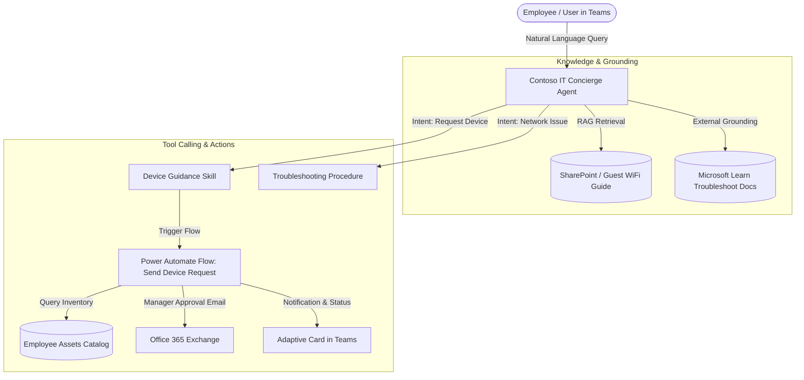
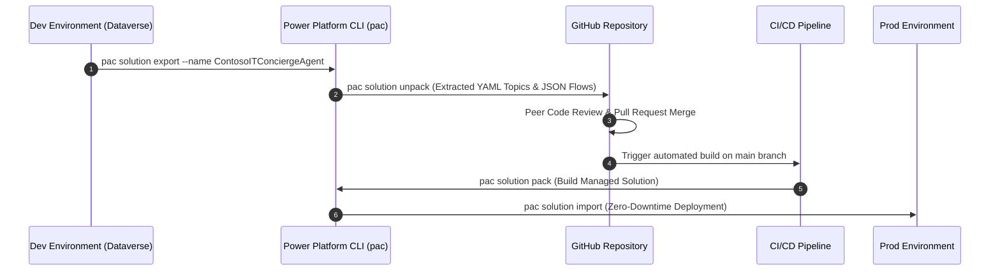

# Contoso IT Support Copilot — Enterprise ALM & DevOps

[](https://copilotstudio.microsoft.com/)
[-217346?logo=powershell)](https://learn.microsoft.com/en-us/power-platform/developer/cli/introduction)
[](https://powerautomate.microsoft.com/)
[](https://git-scm.com/)
[](https://opensource.org/licenses/MIT)
[](https://github.com/dyani368/contoso-it-support-copilot/actions/workflows/alm-deploy.yml)

An enterprise-grade IT Support & Device Request Agent built with **Microsoft Copilot Studio** and **Power Automate**, managed end-to-end via **Power Platform CLI (`pac`)** for source control, automated packaging, and multi-environment Application Lifecycle Management (ALM).

---

## Architecture Overview



---

## Enterprise ALM & DevOps Architecture

In regulated enterprise environments, agents cannot be modified directly in production. This repository demonstrates modern **Git-based ALM** by decoupling graphical low-code design from version-controlled source code.



---

## Solution Component Breakdown (`src/`)

The unpacked solution decomposes Dataverse entities into human-readable, trackable source files:

| Directory | Component Type | Description |
| :--- | :--- | :--- |
| `src/botcomponents/` | **YAML Topic Definitions** | Declarative conversation dialogs, trigger queries, adaptive card layouts, and tool invocation nodes. |
| `src/Workflows/` | **Power Automate JSON** | Cloud workflow definitions (`SendaDeviceRequestemail`) handling inventory queries, approval routing, and API connections. |
| `src/bots/` | **Bot Configuration** | Agent metadata, generative AI orchestrator configurations, and system fallback prompts. |
| `src/Other/` | **Dataverse Schemas** | `customizations.xml` and `solution.xml` specifying solution dependencies, version tracking, and publisher manifests. |

---

## Key Enterprise Features

1. **Grounded Document Retrieval (RAG):**
   * Integrated enterprise documentation (`Contoso_Guest_WiFi_Connection_Guide.docx`) and verified Microsoft Learn endpoints for zero-hallucination IT troubleshooting.
2. **Dynamic Tool Calling:**
   * Uses declarative agent skills (`device-guidance-v1-0-1` and `troubleshooting-procedure`) to dynamically execute tools based on user intent.
3. **Automated Approval Workflows:**
   * Power Automate flow orchestrates automated device verification, inventory availability checks, and manager escalation emails.
4. **Declarative Solution Packaging:**
   * Supports seamless packing and unpacking across Unmanaged (Dev) and Managed (Test/Prod) solution packages using Microsoft's official CLI tooling.

---

## Application Lifecycle Management (ALM) Walkthrough

### 1. Connect & Authenticate to Dataverse
```bash
pac auth create --environment "<Environment-ID-or-URL>"
pac auth list
```

### 2. Export Solution from Development Environment
```bash
pac solution export \
  --name "ContosoITConciergeAgent" \
  --path "./solutions/ContosoITConciergeAgent.zip" \
  --managed false
```

### 3. Decompress Solution to Git-Tracked Source Files
```bash
pac solution unpack \
  --zipfile "./solutions/ContosoITConciergeAgent.zip" \
  --folder "./src"
```

### 4. Re-pack into Managed Solution for Production Release
```bash
pac solution pack \
  --zipfile "./dist/ContosoITConciergeAgent_managed.zip" \
  --folder "./src" \
  --packagetype Managed
```

---

## Technical Stack & Certifications

* **Platform:** Microsoft Copilot Studio, Microsoft Power Automate, Microsoft Dataverse
* **Tooling & ALM:** Power Platform CLI (`pac`), Git, GitHub Actions, Visual Studio Code
* **Languages & Formats:** YAML (Topic schemas), JSON (Workflow schemas), XML (Dataverse manifests)
* **Certification:** Completed **Copilot Studio Agent Academy — Recruit Certification** (Microsoft & Global AI Community)

---

## Author

**Dyaneshwar Mangesh Hawal**  
*Computer and Communication Engineering, Manipal Institute of Technology (MAHE)*  
* GitHub: [@dyani368](https://github.com/dyani368)
